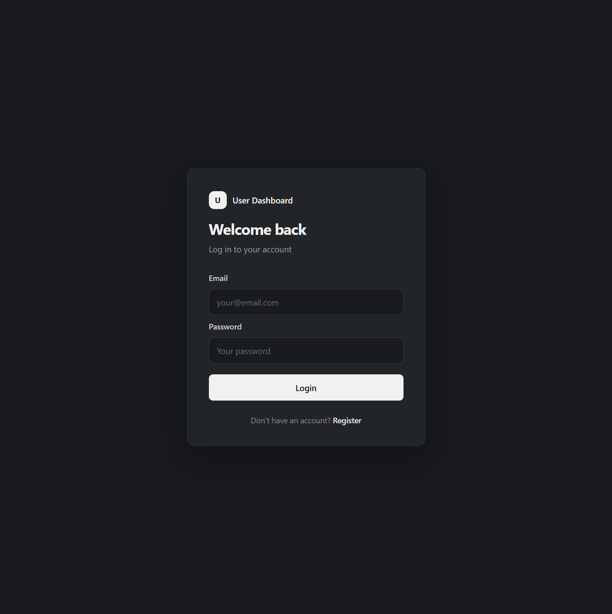
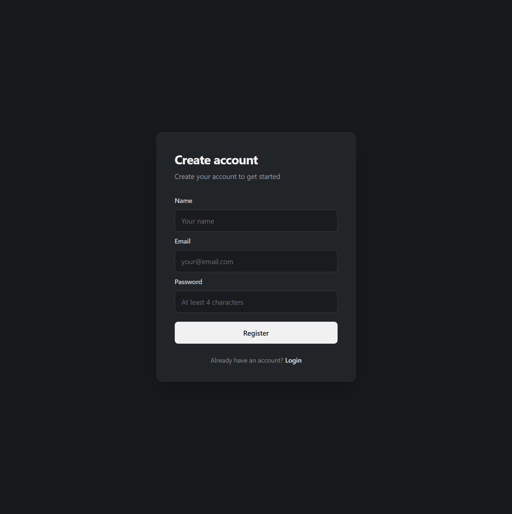
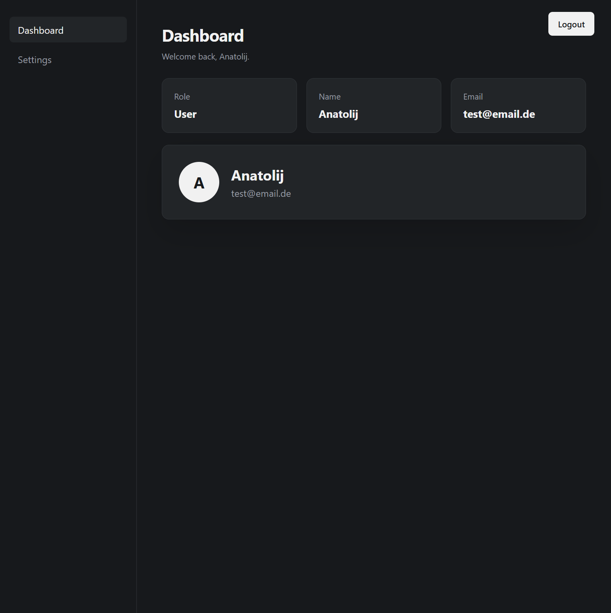
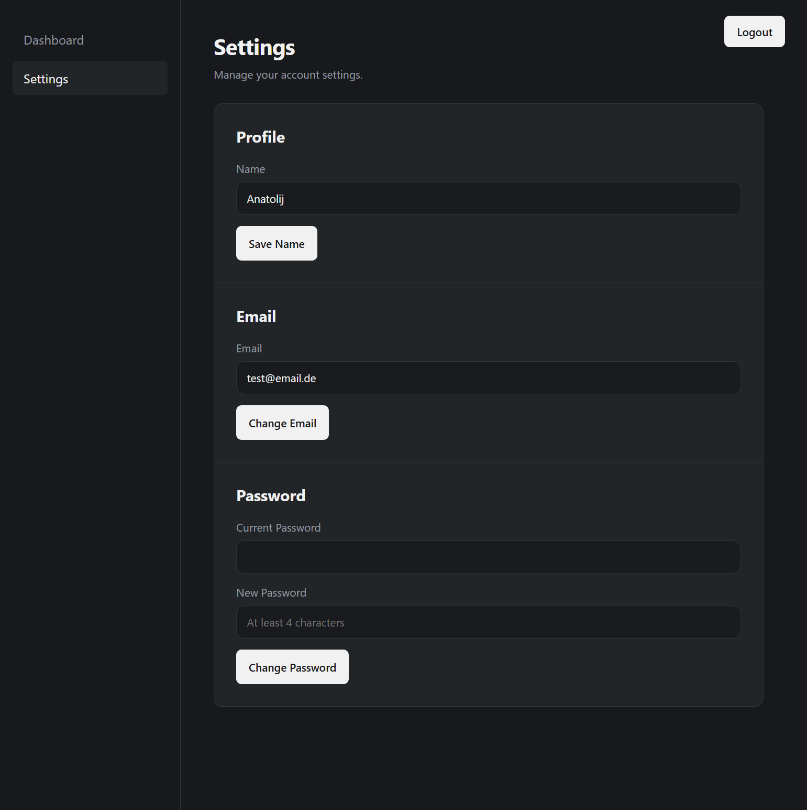

# User Dashboard

A small full-stack project built with React, Node.js, Express, PostgreSQL, Prisma and Docker.

The application provides user registration, login, session-based authentication and a simple dashboard with account settings.

Users can create an account, log in, view their profile information and manage their name, email address and password.


## Goal

The goal of this project was to build a small full-stack application from scratch and understand how the individual technologies work together.

The project focuses on learning the complete flow from a React frontend to an Express REST API, through Prisma to PostgreSQL, including authentication, sessions, password hashing and Docker.


## Technologies

* React + TypeScript - frontend
* Node.js + Express - backend / REST API
* PostgreSQL - database
* Prisma - ORM and database migrations
* bcrypt - password hashing
* express-session - session-based authentication
* Docker + Docker Compose - containerization
* Make - shortcuts for common development and Docker commands


## Features

* User registration
* User login and logout
* Session-based authentication
* Protected routes
* Dashboard with user information
* Update name and email
* Change password
* Password hashing with bcrypt
* PostgreSQL database
* Database migrations with Prisma
* Dockerized development environment


## Screenshots

### Login
Users can log in with their email and password.


### Register
New users can create an account with their name, email and password.


### Dashboard
After logging in, users can view their account information.


### Settings
Users can update their name and email or change their password.



```text
Register
   ↓
Login
   ↓
Dashboard
   ↓
Settings
   ├── Update name
   ├── Update email
   └── Change password
   ↓
Logout
```

## Architecture Note

This project uses Docker to run the frontend, backend, and PostgreSQL database in separate containers.

Nginx and HTTPS are intentionally not included in the current setup, as the project focuses on learning and development rather than production deployment.

For a production environment, Nginx could be added as a reverse proxy together with HTTPS.


## Project Structure

```text
.
├── backend/
│   ├── prisma/
│   └── src/
│       ├── routes/
│       ├── generated/
│       └── ...
├── frontend/
│   └── src/
│       ├── components/
│       ├── context/
│       └── pages/
├── docker-compose.yml
├── Makefile
└── .env.docker
```

## Architecture

```text
React Frontend
      ↓ HTTP / JSON
Express REST API
      ↓
Prisma ORM
      ↓
PostgreSQL
```

The application runs as separate Docker containers for the frontend, backend and database.


## Getting Started

### Prerequisites

Make sure the following tools are installed:

* Node.js
* npm
* Docker
* Docker Compose
* Make

### Setup

Clone the repository and navigate into the project:

```bash
git clone <repository-url>
cd <project-folder>
```

Create the environment files from the provided examples:

```bash
cp .env.example .env
cp .env.docker.example .env.docker
```

Start the application with Docker:

```bash
make build
```

The application will be available at:

* Frontend: http://localhost:5173
* Backend: http://localhost:3000


### Database Setup

After starting the Docker containers for the first time, run the database migrations:

```bash
make migrate
```

This applies all existing Prisma migrations to the PostgreSQL database.


## Make Commands

| Command             | Description                                    |
| ------------------- | ---------------------------------------------- |
| `make build`        | Build and start all Docker containers          |
| `make up`           | Start all Docker containers                    |
| `make down`         | Stop and remove Docker containers              |
| `make restart`      | Restart all Docker containers                  |
| `make logs`         | Show Docker logs                               |
| `make ps`           | Show running Docker containers                 |
| `make migrate`      | Run Prisma database migrations                 |
| `make frontend`     | Start only the frontend container              |
| `make backend`      | Start only the backend container               |
| `make postgres`     | Start only the PostgreSQL container            |
| `make dev-frontend` | Start the frontend locally in development mode |
| `make dev-backend`  | Start the backend locally in development mode  |
| `make clean`        | Stop and remove Docker containers              |


## Authentication

Authentication is handled using server-side sessions.

* Passwords are hashed with bcrypt before being stored.
* After a successful login, the server creates a session containing the user's ID.
* The session ID is stored in a browser cookie.
* Protected API routes check the session before allowing access.
* Logging out destroys the session.


## Local Development

The frontend and backend can also be started locally without Docker.

Start the backend:

```bash
make dev-backend
```

Start the frontend in a separate terminal:

```bash
make dev-frontend
```

The PostgreSQL database can still be run through Docker:

```bash
make postgres
```

This setup is useful for development because changes to the frontend and backend are picked up immediately without rebuilding the Docker images.
